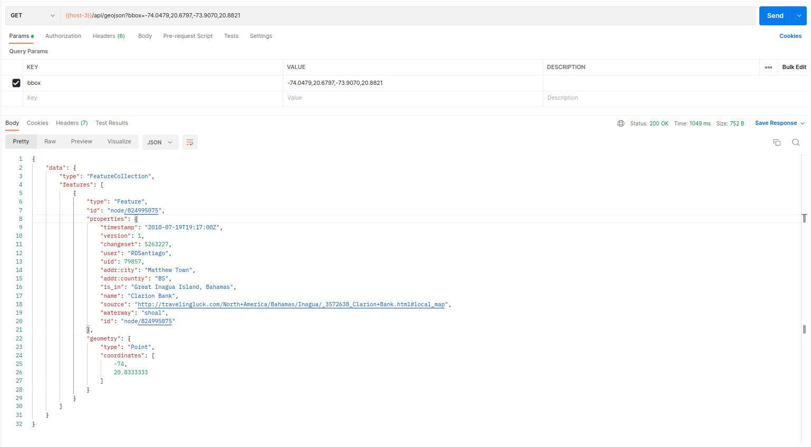

# GeoJSON Converter API

The GeoJSON Converter API is a RESTful service that provides GeoJSON features of a location based on a geolocation box (bounding box) input.  
It fetches information from the [OpenStreetMap API ](https://wiki.openstreetmap.org/)in "osm" format and converts it to "GeoJSON" using the "[osmtogeojson](https://www.npmjs.com/package/osmtogeojson)" library.

## Instructions

To use the GeoJSON Converter API, follow these steps:

1. Clone the repository to your local machine:
```
git clone https://github.com/zwanzigg/geojson.git
```
2. Install the required dependencies:
``` 
npm install
```
3. Build the project:
```
npm run build
```
4. Run the project:
```
npm run start
```
App will start on port 3000 by default. 

5. Once the application is running, you can make a request to the API to get the GeoJSON features. Use the following endpoint:
```
GET http://localhost:3000/api/geojson?bbox=<minLon>,<minLat>,<maxLon>,<maxLat>
```
6. The response will be a GeoJSON object with the features of the location.


## Example

Suppose you want to retrieve the GeoJSON features for a bounding box with the following coordinates:

* Minimum Longitude: -74.0479
* Minimum Latitude: 20.6797
* Maximum Longitude: -73.9070
* Maximum Latitude: 20.8821

Make a GET request to the API as follows:
```
GET http://localhost:3000/api/geojson?bbox=-74.0479,20.6797,-73.9070,20.8821
```

Response:

